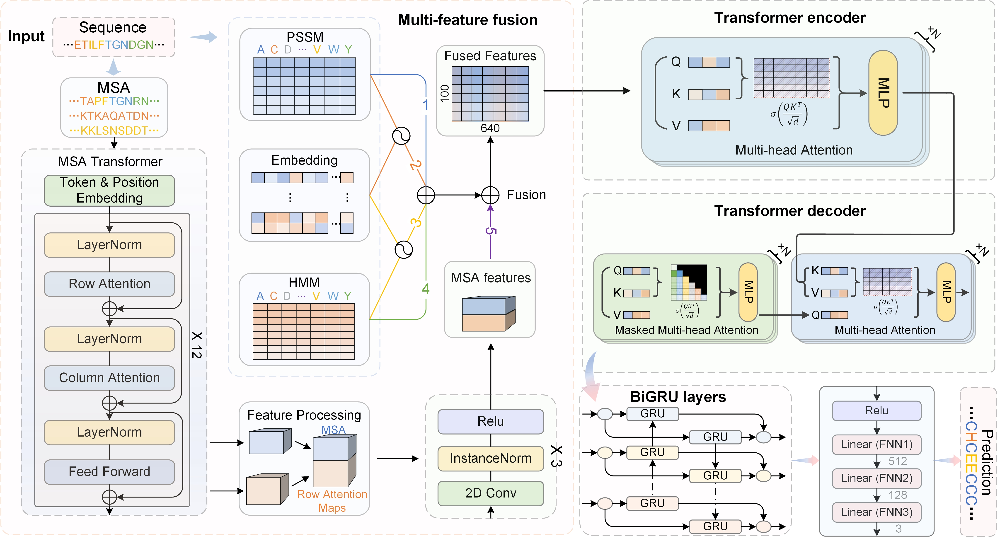

# PSSP-MFFNet
PSSP-MFFNet is a DL-based PSSP multi-feature fusion network that combines a multi-view deep learning architecture and MSA Transformer to
efficiently capture global and local features of protein sequences.

## Framework

## Features
* Adopting a multi-feature fusion strategy, which integrates different features generated from protein sequences.
* Introducing an MSA Transformer to interleave row and column attention across the input MSA.
* Applying a hybrid network architecture of CNN and LSTM networks to extract the high-latent features.
* PSSP-MFFNet outperforms existing methods on several datasets, achieving SOTA.

## Requirements
RUN `pip install -r requirements.txt`

## Train
RUN `python train_my_model.py`

## Test
RUN `python test_my_model.py`

## Trained model
The trained PSSP-MFFNet model can be downloaded in [BaiduNetdisk(code:ic10)](https://pan.baidu.com/s/1vkc4Xoc4h0319GM58y4iAw?pwd=ic10).

